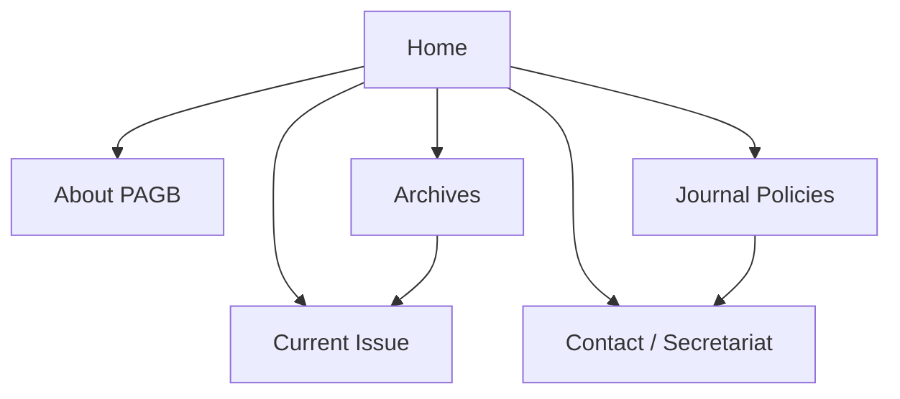
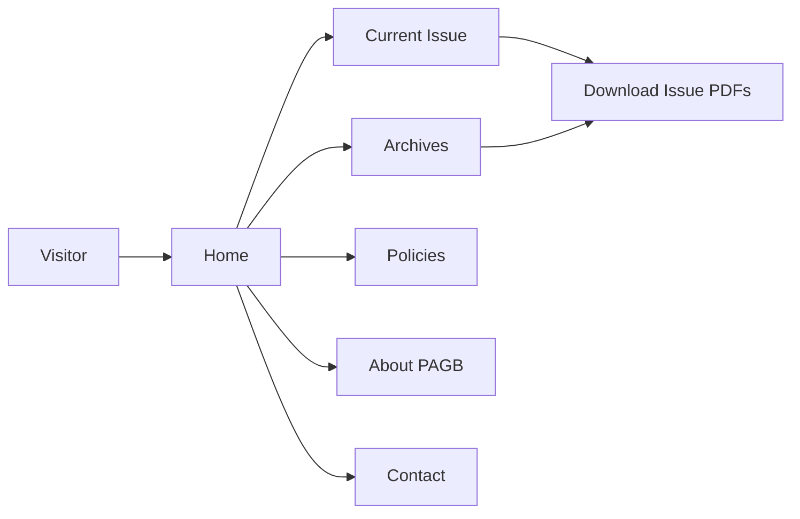

# Design Document
## Pakistan Army Green Book (PAGB) Landing Website

---

## 1. Design Goals and Principles

- **Security-first**: All decisions must support confidentiality, integrity, and availability of publicly exposed PAGB content.
- **Simplicity**: Provide a lightweight, primarily static site with minimal attack surface (no logins, no online submissions, no database).
- **Clarity**: Present PAGB information (About, Current Issue, Archives, Policies) in a structure that is easy to navigate for all visitors.
- **Maintainability**: Use a clean, component-based Next.js layout and static content structure that can be easily updated via controlled deployments.

---

## 2. High-Level Architecture

The system is a **static-first web site**:

- **Client (Browser)** – Renders HTML/CSS/JS for public visitors.
- **Static Site (Next.js build output)** – Pre-rendered pages and assets generated at build time.
- **Static Asset Storage** – File system or object storage for PDFs and images accessible via HTTPS.

### 2.1 Architecture Diagram

```mermaid
flowchart LR
  subgraph Client[Client]
    Visitor[Browser
    (Public Visitors)]
  end

  subgraph Web[Static Site Hosting]
    Pages[Next.js Static Pages
    (Home, About, Current Issue,
    Archives, Policies, Contact)]
    Assets[Static Assets
    (PAGB PDFs, Images)]
  end

  Visitor -->|HTTPS| Pages
  Pages --> Assets
```

### 2.2 Main Code Locations (Static Site)

- `src/app/page.tsx` – Public home page.
- `src/app/about` – About PAGB and mission.
- `src/app/current-issue` – Current issue summary and PDF links.
- `src/app/archives` – Archives listing of past volumes/issues.
- `src/app/authors/[slug]` – Static views of author information and associated PDFs (where configured).
- `src/app/policies/**` – Journal policy pages sourced from `PAGB_POLICIES.md` at build time.
- `public/` or dedicated storage – PAGB PDFs, images, and other static assets.

---

## 3. Site Structure and Navigation

### 3.1 Key Page Types

- **Home**
  - Hero section with PAGB branding and short introduction.
  - Highlight of current issue and key links (Current Issue, Archives, Policies).
- **About PAGB**
  - Mission, scope, and alignment with Pakistan Army training and doctrine.
- **Current Issue**
  - Summary of current volume/issue, theme, and editorial highlights.
  - List of available PDFs for the current issue (where approved for public release).
- **Archives**
  - Listing of past volumes/issues or selected articles, grouped by year or theme.
- **Authors / Contributors (optional)**
  - Static listing of notable contributors and their association with PAGB.
- **Policies**
  - Pages for scope & aims, ethics policy, submission guidance (read-only), and related policies.
- **Contact / Secretariat**
  - Details for contacting PAGB Secretariat via official channels.

### 3.2 Site Map Diagram



---

## 4. Module Design

### 4.1 Public Landing Site Module

- **Responsibilities**:
  - Render all visitor-facing pages (Home, About, Current Issue, Archives, Policies, Contact, Terms/Privacy).
  - Provide consistent layout, navigation bar, footer, and branding across the site.
  - Present structured content blocks that can be updated via content files or configuration.
- **Interactions**:
  - Reads static content and configuration during build time (e.g., markdown policies, JSON issue metadata).
  - Serves generated HTML, CSS, and JS from static hosting.

### 4.2 Static Asset Module

- **Responsibilities**:
  - Organise and serve PAGB PDF files (current issue and archives) from secure static storage.
  - Provide predictable URL patterns for PDFs (e.g., per year/volume folders).
  - Ensure images and branding assets are optimised and cached appropriately.

### 4.3 Configuration & Content Source Module

- **Responsibilities**:
  - Store configuration for navigation labels, URLs, and environment-specific banners.
  - Provide a simple way to update lists of current-issue PDFs and archives through configuration files or build-time scripts.
  - Load and parse `PAGB_POLICIES.md` at build time to populate policy pages.

---

## 5. Security Design

The landing website keeps security focused on **transport**, **hosting**, and **content governance** rather than runtime authentication.

### 5.1 Transport & Hosting

- All traffic to the site must use **HTTPS** with GHQ-approved TLS configuration.
- Static files are hosted on a hardened web server or static hosting service within a controlled environment.
- Reverse proxy or load balancer should enforce security headers such as:
  - `Strict-Transport-Security` (HSTS)
  - `X-Frame-Options: DENY`
  - `X-Content-Type-Options: nosniff`
  - `Referrer-Policy` and `Content-Security-Policy` as appropriate.

### 5.2 Content & Change Control

- Only authorised PAGB Secretariat personnel may approve content changes.
- Deployment pipelines should require change approval and maintain history of released builds.
- No runtime content editing is available from the public site.

### 5.3 Minimal Attack Surface

- No login forms, submission forms, or authenticated APIs are exposed to the internet.
- The site avoids executing untrusted user input; all text rendered is curated content from trusted sources.

### 5.4 Static Asset Security

- PDFs and images are stored in non-executable locations and served with appropriate MIME types.
- Directory indexing is disabled to prevent casual browsing of unlinked files.

---

## 6. API Design

The PAGB Landing Website is intended to operate **without public APIs**. Any dynamic data (e.g., lists of PDFs) is compiled into the static build output.

If limited internal APIs are retained for content discovery, they should:

- Be read-only and exposed only within the trusted network.
- Not require or provide authentication for public visitors.
- Avoid exposing any internal identifiers or sensitive metadata.

---

## 7. Visitor Navigation Flow



---

## 8. UI / UX Layout Overview

### 8.1 Public Pages

- **Home** – Large hero banner, PAGB introduction, featured current issue, and prominent links to key sections.
- **Current Issue** – Simple layout showing current volume/issue details and a list of downloadable PDFs.
- **Archives** – List or grid of past issues or selected articles with clear labels and download links.
- **Authors / Contributors (optional)** – Static cards or list of contributors associated with PAGB.
- **Policies** – Readable policy pages split into sections (Scope & Aims, Ethics, etc.).
- **Contact / Secretariat** – Contact information, location, and communication guidance.

---

## 9. Error Handling and Logging

- Client-side: user-friendly fallbacks for missing content (e.g., 404 page, "PDF not available" message).
- Server/hosting: basic logging of HTTP errors (4xx/5xx) and access logs via the hosting platform.
- Critical availability or security issues are handled through standard operational procedures in the hosting environment.

---

## 10. Extensibility Considerations

- Additional public sections (e.g. news, events) can be added as new static pages with minimal impact.
- Light, anonymous analytics can be integrated (subject to policy approval) to help understand traffic patterns.
- If, in future, online submission or review systems are introduced, the landing site can link to those separate applications without embedding their functionality.
