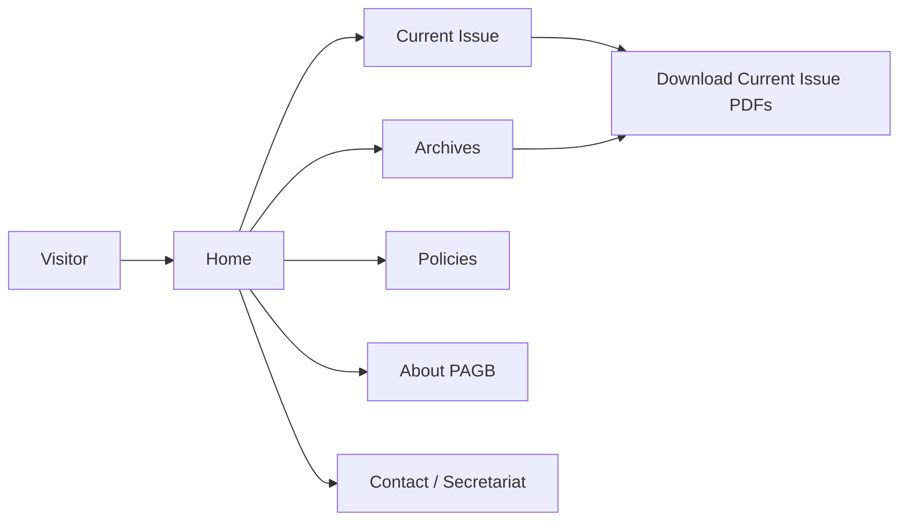

# Prototype Description
## Pakistan Army Green Book (PAGB) Landing Website

---

## 1. Prototype Overview

This document describes the **navigational structure** and **screen-level prototypes** of the PAGB Landing Website. The prototype is implemented as a static-first Next.js UI using TailwindCSS and React components, but this description focuses on the **logical layout and flows** for:

- Public visitors/readers accessing PAGB information.

The goal is to provide a clear, reviewable blueprint of how visitors navigate between pages and discover PAGB content, suitable for **UI/UX review and NOC documentation** of a static public landing site.

---

## 2. Information Architecture (Site Map)

### 2.1 High-Level Navigation

```mermaid
flowchart TD
  Home[Home (/)]
  About[About PAGB (/about)]
  CurrentIssue[Current Issue (/current-issue)]
  Archives[Archives (/archives)]
  Authors[Authors (/authors/[slug])]
  Policies[Journal Policies (/policies)]
  Contact[Contact / Secretariat (/contact)]

  Home --> About
  Home --> CurrentIssue
  Home --> Archives
  Home --> Authors
  Home --> Policies
  Home --> Contact
```

### 2.2 Visitor-Focused Sections

- **Public Visitors**
  - Home
  - About PAGB
  - Current Issue
  - Archives (with simple search or filtering, if configured)
  - Authors profile pages (`/authors/[slug]`, where used)
  - Journal Policies (list and detail)
  - Contact / Secretariat

---

## 3. Public-Facing Pages

### 3.1 Home Page (`/`)

**Layout Prototype (simplified ASCII)**

```
+--------------------------------------------------------------------------------+
| Top Nav: LOGO | Home | About | Current Issue | Archives | Policies | Contact   |
+--------------------------------------------------------------------------------+
| Hero Banner: PAGB branding, call for papers, key message                       |
|                                                                                |
| [Call for Papers Button]    [Download Current Issue PDF]                       |
+--------------------------------------------------------------------------------+
| Section: Highlights / Stats                                                    |
|  - Total Published Articles | Total Authors | Volumes                          |
+--------------------------------------------------------------------------------+
| Section: Featured Articles                                                      |
|  [Article Card] Title, Author, Year, Download PDF                              |
|  [Article Card] ...                                                            |
+--------------------------------------------------------------------------------+
| Section: Journal Policies (links)                                              |
|  - Scope & Aims | Peer Review Policy | Ethics Policy | Submission Guidelines   |
+--------------------------------------------------------------------------------+
| Footer: Contact info, copyright, links to Terms, Privacy, Accessibility       |
+--------------------------------------------------------------------------------+
```

**Key Behaviours**

- Highlight sections and any counts (e.g. number of issues) are derived from **static configuration or content files** prepared at build time.
- Featured content is curated by PAGB Secretariat and surfaced as static cards or links.

### 3.2 About Page (`/about`)

- Static content describing PAGB scope, aims, target audience, and supervision by IGT&E.
- Structured into **sections with headings** and bullet lists.

Layout:

- Top navigation same as Home.
- Two-column or single-column layout with:
  - Mission and scope.
  - Military focus and national security topics.
  - Editorial board overview.

### 3.3 Current Issue (`/current-issue`)

Tabbed layout prototype:

```
+------------------------------------------------------------+
| Tabs: [Volume] [Issue] [Articles] [Editorial Board]        |
+------------------------------------------------------------+
| Volume Tab: Volume number, year, theme, ISSN, frequency.  |
| Issue Tab: Issue number, publication date, abstract.      |
| Articles Tab:                                             |
|   - Table of Articles (Title, Author, PDF Link)           |
| Editorial Board Tab:                                      |
|   - List of editorial members, designations               |
+------------------------------------------------------------+
```

Data for articles is defined in configuration or content files for the current issue and built into the static site.

### 3.4 Archives (`/archives`)

Prototype:

```
+----------------------------------------------------------------+
| Search Bar [              ] (Title / Author)  (Search Button)  |
+----------------------------------------------------------------+
| Archive List (paginated grid/list)                             |
|  - [Article Card]                                              |
|      Title                                                     |
|      Author (clickable -> /authors/[slug])                     |
|      Year / Volume                                            |
|      [View/Download PDF]                                      |
+----------------------------------------------------------------+
```

### 3.5 Author Profile (`/authors/[slug]`)

- Shows author name, total number of published articles, and list of article cards.
- Uses URL-friendly author slug (e.g., `brig-ali-khan`).

Prototype card:

```
[Article Card]
  Title
  Volume / Year
  [Download PDF]
```

### 3.6 Policies (`/policies`, `/policies/[slug]`)

- List view of policies (titles) with short description.
- Detail view shows full markdown content of selected policy.
- Content loaded via `src/lib/policies.ts` from `PAGB_POLICIES.md`.

---

## 4. Visitor Navigation Flow



---

## 5. Visual Style and Components (Summary)

- **Colour scheme**: Army green accents, neutral backgrounds, high-contrast typography for readability.
- **Icons**: `lucide-react` icon set for dashboard items and actions.
- **Components**:
  - Reusable **cards** for articles, stats, and notifications.
  - **Tables** for submissions, reviews, and user requests.
  - **Modals** for reviewer assignment and confirmation dialogs.
  - **Tabs or simple sections** for Current Issue content where appropriate.

This prototype description matches the intended layouts for the PAGB Landing Website and can be used as a reference for UX review, training, and NOC documentation.
