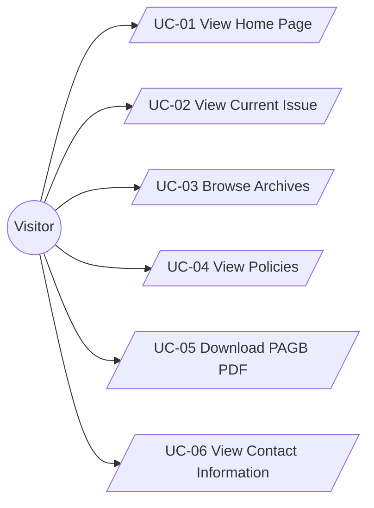

# Use Case Document
## Pakistan Army Green Book (PAGB) Landing Website

---

## 1. Introduction

This document describes the **primary use cases** of the PAGB Landing Website. It is intended for stakeholders, developers, QA staff, and security reviewers to understand how visitors interact with the public site and consume PAGB information.

Use cases are structured with:

- Actors
- Triggers
- Preconditions
- Main Flow
- Alternate / Exception Flows
- Postconditions

---

## 2. Actors

| Actor        | Description                                                     |
|--------------|-----------------------------------------------------------------|
| **Visitor**  | Any unauthenticated user browsing public PAGB content.          |
| **System**   | The PAGB landing website as experienced by visitors.            |

---

## 3. Use Case Diagram (High-Level)

---

## 4. Use Cases

### UC-01: View Home Page

| Item              | Description                                                                                   |
|-------------------|-----------------------------------------------------------------------------------------------|
| **Actors**        | Visitor                                                                                       |
| **Trigger**       | Visitor opens the root URL of the PAGB Landing Website.                                      |
| **Preconditions** | Website is online; home page is deployed.                                                    |
| **Postconditions**| Visitor has seen PAGB branding and can access navigation links to key sections.              |

**Main Flow**

1. Visitor navigates to `/` (Home).
2. System displays PAGB logo, hero text, and short mission statement.
3. System displays highlights for the current issue and links to Archives and Policies.
4. Visitor may click any primary navigation link to move to another section.

**Alternate / Exception Flows**

- **UC-01.A1 – Home content temporarily unavailable**
  - Trigger: Static assets for hero image or text are missing or misconfigured.
  - System shows a generic fallback message without exposing technical details.

---

### UC-02: View Current Issue

| Item              | Description                                                                                   |
|-------------------|-----------------------------------------------------------------------------------------------|
| **Actors**        | Visitor                                                                                       |
| **Trigger**       | Visitor selects "Current Issue" from the navigation menu or home page link.                 |
| **Preconditions** | Current issue details and PDF links have been configured and deployed.                       |
| **Postconditions**| Visitor has viewed information about the current issue and can access any available PDFs.    |

**Main Flow**

1. Visitor clicks **Current Issue** in the navigation bar.
2. System loads the current issue page.
3. System displays volume/issue number, year, theme, and brief description.
4. System lists any available PDFs for the current issue with descriptive labels.
5. Visitor may click a PDF link, invoking UC-05 (Download PAGB PDF).

**Alternate / Exception Flows**

- **UC-02.A1 – No current issue PDFs available**
  - System displays the descriptive text but omits PDF links or shows a note such as "Full text currently not available online".

---

### UC-03: Browse Archives

| Item              | Description                                                                                   |
|-------------------|-----------------------------------------------------------------------------------------------|
| **Actors**        | Visitor                                                                                       |
| **Trigger**       | Visitor selects **Archives** from navigation or home page.                                   |
| **Preconditions** | Archive metadata and PDF links have been defined and deployed.                               |
| **Postconditions**| Visitor has viewed available historical issues and may access PDFs, if available.            |

**Main Flow**

1. Visitor clicks **Archives**.
2. System loads the archives page.
3. System displays a list or grid of past issues grouped by year or volume.
4. Visitor optionally uses any provided filters (e.g., by year or theme) to narrow results.
5. Visitor may click a specific issue to view details and associated PDFs (if implemented) or directly click a PDF link.

**Alternate / Exception Flows**

- **UC-03.A1 – Archive entry missing**
  - Trigger: A configured archive entry points to a missing or moved resource.
  - System shows a generic "Not available" message and logs the issue for review.

- **UC-03.A2 – Network or server error**
  - Trigger: Temporary network or hosting issue.
  - System shows a generic error page; operations team investigates using logs and monitoring.

---

### UC-04: View Policies

| Item              | Description                                                                                   |
|-------------------|-----------------------------------------------------------------------------------------------|
| **Actors**        | Visitor                                                                                       |
| **Trigger**       | Visitor selects **Policies** from navigation or a link on another page.                      |
| **Preconditions** | Policy content is configured and deployed.                                                   |
| **Postconditions**| Visitor has viewed relevant policy text for reference.                                       |

**Main Flow**

1. Visitor clicks **Policies** in navigation.
2. System loads a list of policy topics.
3. Visitor selects a specific policy (e.g. Scope & Aims).
4. System displays the corresponding policy content section.

**Alternate / Exception Flows**

- **UC-04.A1 – Policy not configured**
  - Trigger: Visitor selects a policy that has not yet been configured.
  - System shows a friendly message indicating that the policy text is not currently available.

- **UC-04.A2 – Content formatting issue**
  - Trigger: Policy markdown fails to render correctly.
  - System still shows readable text where possible and logs the formatting issue for content maintenance.

---

### UC-05: Download PAGB PDF

| Item              | Description                                                                                   |
|-------------------|-----------------------------------------------------------------------------------------------|
| **Actors**        | Visitor                                                                                       |
| **Trigger**       | Visitor clicks a PDF link on Current Issue or Archives page.                                 |
| **Preconditions** | The PDF file has been uploaded to static storage and linked on the relevant page.           |
| **Postconditions**| Browser begins downloading or displaying the selected PAGB PDF.                              |

**Main Flow**

1. Visitor identifies a desired issue or article on Current Issue or Archives page.
2. Visitor clicks the associated **Download** button or link.
3. System returns the static PDF file.
4. Browser opens the PDF or prompts visitor to save it.

**Alternate / Exception Flows**

- **UC-05.A1 – PDF missing**
  - Trigger: The linked PDF file is missing or path is misconfigured.
  - System returns a 404 or friendly error page and logs the missing asset.

- **UC-05.A2 – Network or browser error**
  - Trigger: Download interrupted due to network or client-side issue.
  - Visitor may retry the download; system behaviour remains read-only.

---

### UC-06: View Contact Information

| Item              | Description                                                                                   |
|-------------------|-----------------------------------------------------------------------------------------------|
| **Actors**        | Visitor                                                                                       |
| **Trigger**       | Visitor selects **Contact** or similar link.                                                 |
| **Preconditions** | Contact information has been provided by PAGB Secretariat.                                   |
| **Postconditions**| Visitor can see how to contact PAGB Secretariat through approved channels.                   |

**Main Flow**

1. Visitor clicks **Contact** from navigation or footer.
2. System loads the Contact page.
3. System displays appropriate contact details and guidance (postal address, official email aliases, etc.).
4. Visitor notes information for use outside the site (no online form submission is required).

**Alternate / Exception Flows**

- **UC-06.A1 – Contact details temporarily unavailable**
  - Trigger: Contact information has not been configured or is undergoing update.
  - System displays a generic message with alternative guidance (e.g., "Please refer to official Army communication channels").

---

## 5. Summary

These use cases cover the **core visitor journeys** on the PAGB Landing Website:

- Accessing the home page and understanding PAGB’s purpose.
- Viewing the current issue.
- Browsing archives.
- Referring to journal policies.
- Downloading publicly released PAGB PDFs.
- Finding contact details for the PAGB Secretariat.

They are suitable as a basis for test design, accessibility review, and NOC documentation for the static public site.
